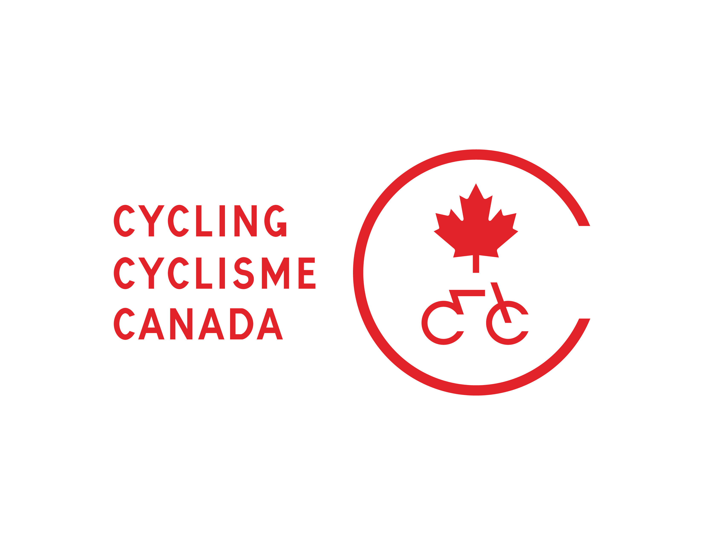

<!-- Références Distill : https://rstudio.github.io/distill/ -->

<!-- Analytics Matomo dans le fichier _footer.html -->

<!-- Pour render : rmarkdown::render_site('guide_sprint') -->

```{r setup, include=FALSE}
knitr::opts_chunk$set(echo = FALSE)

# Gestion avec here
here::i_am("guide2024.Rproj")

```

```{r call_Libs_Vars, include=FALSE}
# Appel des librairies et variables partagées
source(here::here("code","_LibsVars.R"))

# Dates
source(here("code", "_Dates.R"))

# Langue
lang <- "FR"

# Locale
## https://www.rdocumentation.org/packages/base/versions/3.6.2/topics/locales
{if (lang == "FR") Sys.setlocale("LC_TIME", locale = "fr_CA.UTF-8") 
  else Sys.setlocale("LC_TIME", locale = "en_US.UTF-8") }

opts_chunk$set( tidy = FALSE, comment = NA,
                fig.align = "center",
                fig.width = 7.5, fig.height = 7.5,
                fig.retina = 2, cache = FALSE,
                class.output = "codeout",
                warning = FALSE,
                message = FALSE,
                quiet=TRUE)

```


:::: {style="display: grid; grid-template-columns: 1fr 1fr; grid-column-gap: 40px;"}

::: {}
La `r params$edition_ChallengeSprint`^e^ édition du **Challenge Sprint Abitibi** est organisée le lundi `r dates_FR %>% filter(code ==  "Lun_Av") %>% pull(jour_mois_an)` en marge du **Tour de l'Abitibi `r params$sponsor`** suite à la présentation des équipes. L'objectif de cette épreuve est de pouvoir présenter chacune des équipes en actions et d'offrir un spectacle de haute qualité à la population locale de même qu'aux téléspectateurs. 
:::

:::{}
The `r params$edition_ChallengeSprint`^th^ edition of the **Challenge Sprint Abitibi** is presented on monday `r dates_EN %>% filter(code ==  "Lun_Av") %>% pull(jour_mois_an)` after the **Tour de l'Abitibi `r params$sponsor`** teams presentation. The aim of this event is to showcase each teams in action, and to provide a high-quality spectacle for the local population and television viewers alike.
:::
::::
<aside>
  <a href="https://tourabitibi.com" target="_blank" >
  
  </a>
  
  Présenté par / Presented by  
  
  <a href="https://www.canada.ca/fr.html" target="_blank" >
  
  </a>
</aside>

## Description

:::: {style="display: grid; grid-template-columns: 1fr 1fr; grid-column-gap: 40px;"}

::: {}
Le **Challenge Sprint Abitibi** consiste en une série de sprints disputés entre quatre coureurs, avec un processus d’élimination simple afin de couronner le meilleur sprinter. Les sprints seront disputés sur une distance de 600 mètres, soit un aller-retour de 300 m intégrant un virage autour d’une série de cônes.
:::

::: {}
The **Challenge Sprint Abitibi** consists of a series of sprints between four cyclists, with a simple elimination process, in order to determine the best sprinter. Sprints will take place over a 600-meter distance, in a 300 meters round-trip around a series of cones.
:::
::::

<!-- Logos Cyclisme Canada et FQSC  -->
<aside>
  <a href="https://cyclingcanada.ca/" target="_blank" >
  
  </a>
  
  <a href="https://fqsc.net/" target="_blank" >
  
  </a>
</aside>

:::: {style="display: grid; grid-template-columns: 1fr 1fr; grid-column-gap: 40px;"}
::: {}
Un seul coureur de chaque équipe est sélectionné par son équipe pour la représenter contre les meilleurs sprinters du Tour de l'Abitibi. 
:::

:::{}
Only one rider from each team is selected by his team to represent it against the best sprinters of the Tour de l'Abitibi. 
:::
:::: 

## Horaire / Schedule 
<!-- Heures à valider -->

:::: {style="display: grid; grid-template-columns: 2fr 1fr 2fr; grid-column-gap: 40px;"}
::: {}
Réunion obligatoire des directeurs sportifs   
:::

::: {}
13:30 - 14:00   
:::

:::{}
Mandatory team managers meeting    
:::
::::

:::: {style="display: grid; grid-template-columns: 2fr 1fr 2fr; grid-column-gap: 40px;"}
::: {}
Présentation des équipes, prise de photos des coureurs, directeurs sportifs, mécaniciens et massothérapeutes avec les partenaires   
:::

::: {}
16:30 - 17:00   
:::

:::{}
Team presentation, official photo session with riders, team managers, mechanics and therapists with sponsors   
:::
::::

:::: {style="display: grid; grid-template-columns: 2fr 1fr 2fr; grid-column-gap: 40px;"}
::: {}
Échauffement sur le circuit   
:::

::: {}
17:10 - 17:25   
:::

:::{}
Warm-up on circuit  
:::
::::


:::: {style="display: grid; grid-template-columns: 2fr 1fr 2fr; grid-column-gap: 40px;"}
::: {}
**Challenge Sprint Abitibi**   
:::

::: {}
**17:30 - 19:00**   
:::

:::{}
**Challenge Sprint Abitibi**   
:::
::::

:::: {style="display: grid; grid-template-columns: 2fr 1fr 2fr; grid-column-gap: 40px;"}
::: {}
Cérémonies protocolaires   
:::

::: {}
19:15 - 19:30   
:::

:::{}
Awards ceremonies   
:::
::::


## Parcours / Course

:::: {style="display: grid; grid-template-columns: 1fr 1fr; grid-column-gap: 40px;"}
::: {}
Les sprints se déroule sur la `r params$rue_ligne_arrivee` à `r params$ville` devant le `r params$position_ligne_arrivee`. 
:::

:::{}
The sprints take place on `r params$rue_ligne_arrivee` in `r params$ville`, in front of the `r params$position_ligne_arrivee_EN`. 
:::
:::: 

<aside>
  <a href="https://ville.valdor.qc.ca/" target="_blank" >
  
  </a>
</aside>

```{r sprint_parcours, echo=TRUE, echo=FALSE, out.width= "95%", align="center"}
knitr::include_graphics(here("img", "sprint", "Sprint_Parcours.png"))
```

## Dénivelé / Elevation

```{r sprint_deniv, echo=TRUE, echo=FALSE, out.width= "95%", align="center"}
knitr::include_graphics(here("img", "sprint", "Sprint_Deniv.png"))
```


## Note
:::: {style="display: grid; grid-template-columns: 1fr 1fr; grid-column-gap: 40px;"}

::: {}
Le guide technique complet du **Tour de l'Abitibi `r params$sponsor`** ainsi que la feuille de route complète est disponible au : <a href="../FR/index.html" target="_blank">https://tourabitibi.github.io/guide2024/FR/</a> 
:::

:::{}
The complete **Tour de l'Abitibi `r params$sponsor`** technical guide and the complete schedule is available at : <a href="../EN/index.html" target="_blank">https://tourabitibi.github.io/guide2024/EN/</a> 
:::
::::