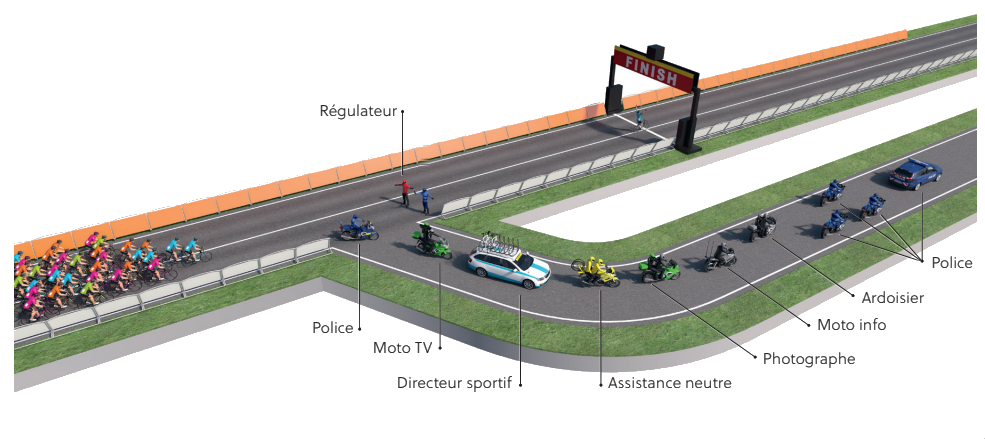

# Dossier : img

Images nécessaires à la création des documents. 

> Plusieurs images statiques sont aussi en ligne à : https://brunogauthier.imgbb.com

## cartes

Cartes détaillées des parcours complets, départ et arrivées.

## elev

Profil topographique de chaque étape :

- Général et détails dernieres km;
- FR et EN.

### Exemple

## logo

Différents logos du Tour de l'Abitibi et des commanditaires (`comm_1.png`)

## photos

Photos utilisées dans le guide

## sign

Images (capture d'écran de Google StreetView ou photo) des points de signalisation qui doivent être identifiés au guide d'organisation. 

### Exemple

## support

Image de support pour le guide. Par exemple, image de la caravane de course. 

### rampe et sites

Photos spécifiques pour supporter l'installation des sites par l'équipe logistique. Sert dans les pages `rmd/CLMI_notes.Rmd` et `rmd/Sites.Rmd`

### Exemple

