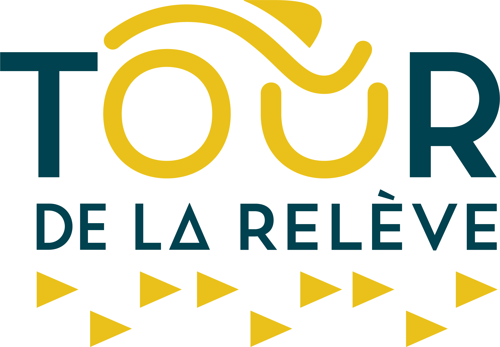

<!-- Références Distill : https://rstudio.github.io/distill/ -->

<!-- Analytics Matomo dans le fichier _footer.html -->

<!-- Pour render : rmarkdown::render_site('prog_prelim') -->

```{r setup, include=FALSE}
knitr::opts_chunk$set(echo = FALSE)

# Gestion avec here
here::i_am("guide2024.Rproj")

```

```{r call_Libs_Vars, include=FALSE}

# Appel des librairies et variables partagées
source(here::here("code","_LibsVars.R"))

# Dates
source(here("code", "_Dates.R"))

# Pour accès aux données du fichier excel Itineraires.xlsx
source(here("code","_import_itineraire.R"))

# Langue
lang <- "FR"

# Locale
## https://www.rdocumentation.org/packages/base/versions/3.6.2/topics/locales
{if (lang == "FR") Sys.setlocale("LC_TIME", locale = "fr_CA.UTF-8") 
  else Sys.setlocale("LC_TIME", locale = "en_US.UTF-8") }

opts_chunk$set( tidy = FALSE, comment = NA,
                fig.align = "center",
                fig.width = 7.5, fig.height = 7.5,
                fig.retina = 2, cache = FALSE,
                class.output = "codeout",
                echo = FALSE,
                warning = FALSE,
                message = FALSE,
                quiet=TRUE)

```


## `r dates_FR %>% filter(code=="Sam") %>% pull(jsem_jour_mois_an)` AM - Route

Courses sur route - 8h à 13h30    

Distances variables selon les âges  - Aller-Retour de / vers la Cathédrale d'Amos

<iframe src="https://ridewithgps.com/embeds?type=route&id=45032641&metricUnits=true&sampleGraph=true&distanceMarkers=true" style="width: 1px; min-width: 100%; height: 700px; border: none;" scrolling="no"></iframe>

<aside>
  <a href="https://tourabitibi.com" target="_blank" >
  
  </a>
</aside>

## `r dates_FR %>% filter(code=="Sam") %>% pull(jsem_jour_mois_an)` PM - Sprint

### Sprint de 12h30 à 15h30   

<iframe src="https://ridewithgps.com/embeds?type=route&id=45310471&metricUnits=true&sampleGraph=true" style="width: 1px; min-width: 100%; height: 700px; border: none;" scrolling="no"></iframe>

### Jeux d'habilité de 12h30 à 15h30 

Endroit à déterminer

## `r dates_FR %>% filter(code=="Dim") %>% pull(jsem_jour_mois_an)` AM - Critérium

Critérium de 8h à 13h

<iframe src="https://ridewithgps.com/embeds?type=route&id=45310454&metricUnits=true&sampleGraph=true" style="width: 1px; min-width: 100%; height: 700px; border: none;" scrolling="no"></iframe> 

