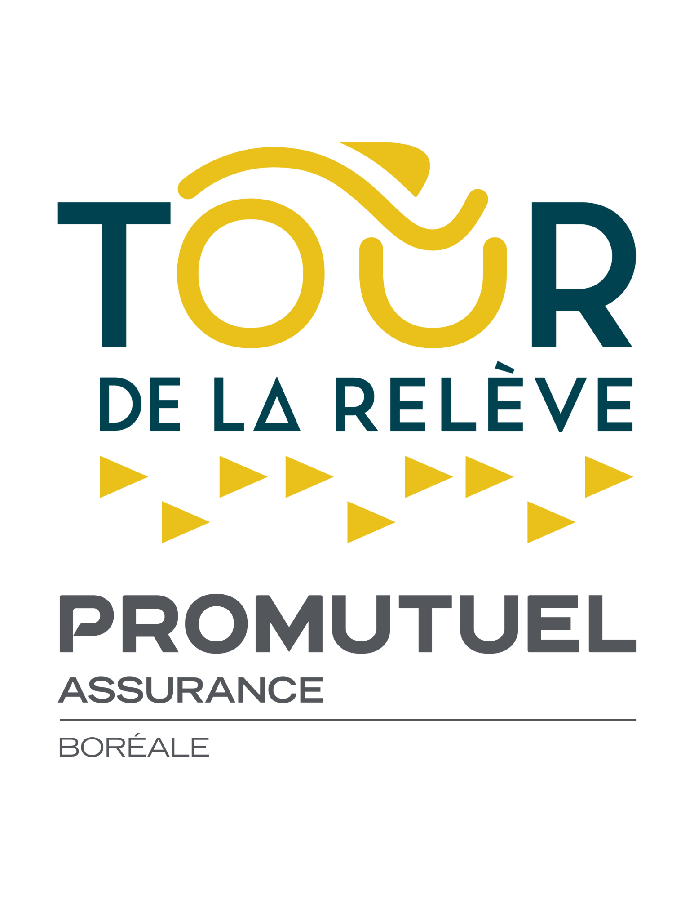

<!-- Références Distill : https://rstudio.github.io/distill/ -->

<!-- Analytics Matomo dans le fichier _footer.html -->

<!-- Pour render : rmarkdown::render_site('prog_prelim') -->

```{r setup, include=FALSE}
knitr::opts_chunk$set(echo = FALSE)

# Gestion avec here
here::i_am("guide2024.Rproj")

```

```{r call_Libs_Vars, include=FALSE}

# Appel des librairies et variables partagées
source(here::here("code","_LibsVars.R"))

# Dates
source(here("code", "_Dates.R"))

# Pour accès aux données du fichier excel Itineraires.xlsx
source(here("code","_import_itineraire.R"))

# Langue
lang <- "FR"

# Locale
## https://www.rdocumentation.org/packages/base/versions/3.6.2/topics/locales
{if (lang == "FR") Sys.setlocale("LC_TIME", locale = "fr_CA.UTF-8") 
  else Sys.setlocale("LC_TIME", locale = "en_US.UTF-8") }

opts_chunk$set( tidy = FALSE, comment = NA,
                fig.align = "center",
                fig.width = 7.5, fig.height = 7.5,
                fig.retina = 2, cache = FALSE,
                class.output = "codeout",
                echo = FALSE,
                warning = FALSE,
                message = FALSE,
                quiet=TRUE)

```


```{r params}

data <- iti_etape$Details %>% 
  select(Etape, 
         Descr_Villes, 
         Descr_km,
         KM_Total, 
         km_neutres = KM_Neutres, 
         nb_tours = Nb_tours,
         km_par_tour = KM_par_tours,
         Distance_Route, 
         Distance_en_circuit, 
         Distance_totale,
         Liens, 
         heure_dep = Depart,
         heure_arr_circuit = HeureEntreeVille, 
         heure_arr_finale = time_arrivee
         ) %>% 
  # Correction si heure est mal formatée - par exemple : 14:0  
  mutate(heure_dep = str_replace(heure_dep, "(\\d):0$", "\\1:00"),
         heure_arr_circuit = str_replace(heure_arr_circuit, "(\\d):0$", "\\1:00"),
         heure_arr_finale = str_replace(heure_arr_finale, "(\\d):0$", "\\1:00") )


```

```{r fun_lien_iframe}

lien_iframe <- function(etape){
  
  ## Derniers chiffres de "https://ridewithgps.com/routes/123456789"
  id_RWG <- str_extract(data$Liens[etape], "\\d*$") 
  
  # Création d'un lien de type iframe
  lien <- glue('<iframe src="https://ridewithgps.com/embeds?type=route&id={id_RWG}&metricUnits=true&sampleGraph=true" style="width: 1px; min-width: 100%; height: 700px; border: none;" scrolling="no"></iframe>')
  
  return (lien)
}
```

## `r dates_FR %>% filter(code=="Sam") %>% pull(jsem_jour_mois_an)` AM - Route

Courses sur route - 8h à 13h30    

Distances variables selon les âges  - Aller-Retour de / vers la Cathédrale d'Amos

<iframe src="https://ridewithgps.com/embeds?type=route&id=39662474&metricUnits=true&sampleGraph=true" style="width: 1px; min-width: 100%; height: 700px; border: none;" scrolling="no"></iframe>

<aside>
  <a href="https://tourabitibi.com" target="_blank" >
  
  </a>
</aside>

## `r dates_FR %>% filter(code=="Sam") %>% pull(jsem_jour_mois_an)` PM - Sprint

Sprint et jeux d'habilité de  12h30 à 15h30   

<iframe src="https://ridewithgps.com/embeds?type=route&id=39662449&metricUnits=true&sampleGraph=true" style="width: 1px; min-width: 100%; height: 700px; border: none;" scrolling="no"></iframe>   


## `r dates_FR %>% filter(code=="Dim") %>% pull(jsem_jour_mois_an)` AM - Critérium

Critérium de 8h à 13h

<iframe src="https://ridewithgps.com/embeds?type=route&id=39662424&metricUnits=true" style="width: 1px; min-width: 100%; height: 550px; border: none;" scrolling="no"></iframe>   


